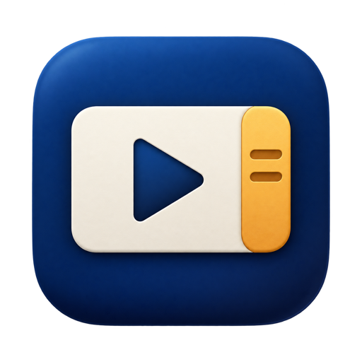

<p align="center">
  
</p>

<h1 align="center">Timemark</h1>

<p align="center">
  Pin notes to the exact moment in a video lesson.<br>
  A native macOS app for studying from video.
</p>

<p align="center">
  
  
  
  
  
</p>


## Overview

Watching a lesson is easy. Finding the one part you needed again is not. Timemark lets you pause anywhere and write a note pinned to that moment. Every note shows up as a pin on a timeline under the video, so you can hover to read it and click to jump straight back.

It works with any folder of videos: a course, a set of recorded talks, or your own lessons.

## Features

- **The full system player.** Play and pause, scrubbing, skipping, volume, playback speed, captions, frame stepping, Picture in Picture, AirPlay, and full screen. It's the same `AVPlayerView` as QuickTime Player.
- **Notes pinned to moments.** Press ⌘N and the video pauses. Write your note and press Return, and it's saved at that timestamp.
- **Note timeline.** Every note is a pin on the ruler under the video. Hover a pin to read the note, and click it to jump there. As the video plays past a note, that note's text shows on the ruler.
- **Chapters, YouTube style.** If a video has chapters, the timeline is split into one segment per chapter. Hover the timeline and that segment grows, with a preview of the chapter's thumbnail, title, and time floating above it. The side panel's **Chapters** tab lists every chapter with a thumbnail and start time, highlights the one playing, and jumps there when clicked. The **Chapters** toolbar menu and ⌥⌘[ or ⌥⌘] work too.
- **Lesson library.** Videos are grouped by week. Each lesson shows its title, its day, and how many notes it has.
- **Notes panel.** The note you're currently at is marked in highlighter yellow. Edit, delete, and multi-select notes with standard macOS gestures, and undo or redo any change.
- **Fits the video.** The window sizes itself to the video, so there are no empty bars. In full screen or a maximized window, the video is centered on black.
- **Private by design.** It runs sandboxed, with no network access. It only reads the folder you choose.

## Requirements

| | |
| --- | --- |
| macOS | 14 Sonoma or later |
| Xcode | 16 or later (to build) |

## Installation

Clone the repository and build the app:

```sh
git clone https://github.com/rohithgoud30/Timemark.git
cd Timemark
xcodebuild -project Timemark.xcodeproj -target Timemark -configuration Release build
cp -R build/Release/Timemark.app /Applications/
open /Applications/Timemark.app
```

Or open `Timemark.xcodeproj` in Xcode, choose the **Timemark** scheme and **My Mac**, and press ⌘R.

The project is signed to run locally (ad hoc). To share a build with someone else, set your Team under **Signing & Capabilities** and archive it from Xcode.

## Usage

1. Click **Choose Folder…** and pick the folder that holds your videos. Timemark finds MP4, MOV, and M4V files in it and in all its subfolders.
2. Pick a lesson in the sidebar and play it.
3. When something is worth remembering, press **⌘N**. The video pauses and the note box opens.
4. Type your note and press **Return**. Option-Return starts a new line, and Escape cancels.

### Keyboard shortcuts

| Action | Shortcut |
| --- | --- |
| Choose folder | ⌘O |
| Add a note at the current moment | ⌘N |
| Play or pause (from the menu) | ⌥⌘P |
| Play or pause (player focused) | Space |
| Skip back or forward 10 seconds | ⌥⌘← or ⌥⌘→ |
| Previous or next chapter | ⌥⌘[ or ⌥⌘] |
| Previous or next lesson | ⌘[ or ⌘] |
| Undo or redo | ⌘Z or ⇧⌘Z |
| Delete the selected notes | Delete |
| Show or hide the sidebar | ⌃⌘S |
| Show or hide the notes panel | ⌃⌘I |

## How notes are stored

Each video's notes live in a JSON file next to the video, with the same name:

```
lesson-1/
├── lesson-1.mp4
└── lesson-1.notes.json
```

```json
[
  {
    "id" : "5F0C2A9E-…",
    "text" : "Code runs top to bottom.",
    "time" : 95.2
  }
]
```

`time` is in seconds from the start of the video. Because the notes sit beside the videos, moving or backing up the folder keeps them together. When you delete a video's last note, its notes file is removed too.

Lesson titles come from the file name. Optionally, a `script.json` beside the video whose first slide has a `title` provides a nicer one.

## Privacy

Timemark runs in the macOS App Sandbox with access only to the folder you choose. It remembers that folder with a security-scoped bookmark. It makes no network requests and collects no data.

## Project structure

```
Timemark/
├── Timemark.xcodeproj
├── Timemark.entitlements     Sandbox: user-selected files (read and write), bookmarks
├── docs/                     README image
└── Timemark/
    ├── TimemarkApp.swift     App entry, window, menus and shortcuts
    ├── LibraryModel.swift    Folder, videos, playback state, note storage and undo
    ├── ContentView.swift     Split view, sidebar, empty states, window fitting
    ├── PlayerView.swift      System player and the note timeline
    ├── NotesPane.swift       Notes panel, note rows, and the note box
    ├── Theme.swift           Highlighter accent and note typeface
    └── Assets.xcassets       App icon
```

## Design

- **One accent color:** highlighter yellow, used only for note pins, playback progress, and the current note.
- **Notes set in New York,** the system serif, so they read like handwritten margin notes. Everything else uses the system font, so the app feels at home on macOS.
- **Standard macOS behavior:** Light and Dark Mode, VoiceOver labels on pins and timestamps, standard menus and shortcuts, and undo.

## Known limitations

- Chapters are read from the video file (QuickTime-style chapter tracks, which most video tools can write). Timemark doesn't create or edit chapters.
- Note pins sit on Timemark's own timeline, not on the player's built-in scrubber. macOS has no public API for adding markers there.
- One window at a time.

## License

Timemark is released under the [MIT License](LICENSE).
